# APL: Automated Preferential Looking
<!-- TABLE OF CONTENTS -->
## :book: Table of Contents

1. [➤ About The Project](#pencil-about-the-project)
2. [➤ Prerequisites](#prerequisites)
3. [➤ Roadmap](#dart-roadmap)
4. [➤ Folder Structure](#cactus-folder-structure)
5. [➤ Implementation](#implementation)
6. [➤ Features](#features)
7. [➤ Future Goals](#future-goals)
8. [➤ Acknowledgments](#acknowledgments)

    <!-- <li><a href="#libraries-used"> ➤ Libraries Used</a></li>
    <li><a href="#roadmap"> ➤ Roadmap</a></li>
    <li><a href="#folder-structure"> ➤ Folder Structure</a></li>
    <li><a href="#implementation"> ➤ Implementation</a></li>
    <li><a href="#feature"> ➤ Features</a></li>
    <li><a href="#future"> ➤ Future Goals</a></li>
    <li><a href="#acknowledgments"> ➤ Acknowledgments</a></li>
  <!-- </ol>


-----------------------------------------------------

<!-- <h2 id="about-the-project"> :pencil: About The project</h2> -->
## :pencil: About The project
This project is the work for the Google Summer of Code 2024, with the organisation INCF. The project is created by [Dhruvanshu Joshi](https://github.com/Dhruvanshu-Joshi) under the mentoring of Suresh Krishna, PhD from McGill University and [Soham Mulye](https://github.com/Shazam213).
This project aims to extend the work done in [GSOC, 2023](https://github.com/Shazam213/automated-preferential-looking/tree/main) and primarily aims to eliminate time delays, offer a visually appealing GUI, package the code into a application and test the software on infants.


-----------------------------------------------------

<!-- PREREQUISITES -->
<!-- <h2 id="prerequisites"> Prerequisites</h2> -->
## Prerequisites
[](https://www.python.org/) <br>


<!--This project is written in Python programming language. <br>-->
The following open source packages are used in this project:
* Numpy
* Matplotlib
* Scikit-Learn
* TensorFlow
* Keras
* PsychoPy
* OpenCV
* Tkinter
* PyQT6
* PyInstaller

-----------------------------------------------------


<!-- ROADMAP -->
<!-- <h2 id="roadmap"> :dart: Roadmap</h2> -->
## :dart: Roadmap

The result of this work which was about 420 hours, is divided in the following parts:

1. Restructuring the Workflow pipeline:
    *   Restructured the workflow to process predictions in bulk at the end of the experiment, significantly reducing delays. Delays were originally introduced to at the end of each stimulus to offer time to make predictions using the icatcher+ eye tracking model. By processing this at the end, we eliminate the need for delays all together.

2. User-Friendly GUI:

    *  To enhance the user experience, the graphical user interface (GUI) was transitioned from Tkinter to PyQt. This modernization provided a more intuitive and feature-rich interface, improving the overall usability of the application. The PyQt-based GUI also allowed for better customization and flexibility, making it easier for users to navigate through the various functionalities, including visual stimuli experiments and eye-tracking features.

3. Program Integration and Packaging::
    * The various components of the project, including the visual stimuli experiments, eye-tracking functionality, and data analysis, were integrated into a cohesive Python program. To facilitate distribution and deployment, the entire codebase was packaged into an executable application using PyInstaller. This packaging ensures that the application can be easily installed and run on different systems without requiring users to manually manage dependencies or configurations.

4. Experiment Validation and Expansion:

    * To ensure the robustness and accuracy of the experiments, options were introduced to perform experiments using live camera video as well as pre-recorded videos from the Lookit dataset. This addition provided a broader validation of the eye-tracking model's performance across different scenarios. Pre-recoded infant video were used from the [look-it](https://osf.io/5u9df/) dataset.
    
5. Adding four quadrant support

    * I explored two methods to add four quadrant support. First one was using the mediapipe. We'll first get the iris postions when looking at the central fixation point. Then we'll track the movement of the iris and whenever there is significant movement along a specfic direction [northwest, southwest, northeast, southeast], we'll classify the gaze to be in that direction. To accomodate for the translational motion of the face, we also trace the infants face and normalise the gaze position of iris at the central fixation point accordingly. This method has a drawback wherein it fails to give correct output in case of rotatory motion of the infant's head.
    * Another method that can help is introducing a caliberation step to caliberate the infants gaze for stimulus in different quadrants and training a small classifier network that can predict the direction of gaze correctly for different head positions. However this is just an early stage conceptual idea which needs further implementation and testing.
-----------------------------------------------------

<!-- :paw_prints:-->
<!-- FOLDER STRUCTURE -->
<!-- <h2 id="folder-structure"> :cactus: Folder Structure</h2> -->
## :cactus: Folder Structure  
        .
        └── automated-preferential-looking/
        ├── PyQT_screens
        │ ├── imgs
        │ ├── init.py
        │ ├── index.py
        │ ├── screen2.py
        │ ├── screen3.py
        │ ├── screen4.py
        │ ├── screen5.py
        │ ├── screen6.py
        │ ├── screen7.py
        │ ├── screen8.py
        │ └── screen9.py
        ├── resources
        ├── src/
        │ ├── data
        │ ├── pycache
        │ ├── icatcher/
        │ ├── init.py
        │ ├── fixed_increment.py
        │ ├── fixed_increment_icatcher.py
        │ ├── gui.py
        │ ├── main.py
        │ ├── predict.py
        │ ├── psychometric_function.py
        │ ├── result.py
        │ ├── staircase.py
        │ └── staircase_icatcher.py
        ├── LICENSE
        ├── README.md
        └── requirements.txt
    

-----------------------------------------------------
<!-- :paw_prints:-->
<!-- IMPLEMENTATION -->
<!-- <h2 id="implementation"> Implementation</h2> -->
## Implementation

To execute the program on your system, please follow these steps.
* Clone the repository into your local system:
    ```sh
    https://github.com/Dhruvanshu-Joshi/automated-preferential-looking
    ```

* Navigate to the cloned directory:
    ```sh
    cd automated-preferential-looking
    ```

* Download all the required packages:
    ```sh
    pip install -r requirements.txt
    ```
* Navigate to the src folder:
    ```sh
    cd src
    ```

* Now execute the program:
    ```sh
    python main.py
    ```
    
* To package the code use the script:
    ```sh
    python -m PyInstaller --onefile --add-binary="path to freetype.dll;." --add-data="path to psychopy" --add-data="path to PyQT_screens" --add-data="path to src" --add-data="path to python Lib" --paths=src --exclude-module=PyQt5 src/main.py
    ```
    An example of this is:
    ```sh
    python -m PyInstaller --onefile --add-binary="freetype.dll;." --add-data="C:\Users\jmahe\AppData\Roaming\Python\Python311\site-packages\psychopy;psychopy" --add-data="PyQT_screens;PyQT_screens" --add-data="src;src" --add-data="C:\Program Files\Python311\Lib;Lib" --paths=src --exclude-module=PyQt5 src/main.py

    ```

    * In case you run into absence of ```freetype.dll```, download it from[here](https://drive.google.com/drive/folders/1KxNelo4lmJIQHOrChmyu1MH3nsUQQyC1) and use its path.

Ps- You might face errors while psychopy installations. You can refer this [link](https://github.com/Shazam213/automated-preferential-looking/tree/visual-stimuli#getting-started).

* The final application and some results on actual infants can be found [here](https://drive.google.com/drive/folders/1EyiCTeTBk5worOztW1KTkYCRiYcNhhuq?usp=drive_link).

* When running for the first time the app may take some time to load all the packages and also to download the eye tracking model.

-----------------------------------------------------
<!-- :paw_prints:-->
<!-- FEATURE -->
<!-- <h2 id="feature"> Features</h2> -->
## Features
 
 1. Starting the Program you first get the easy to use GUI.
 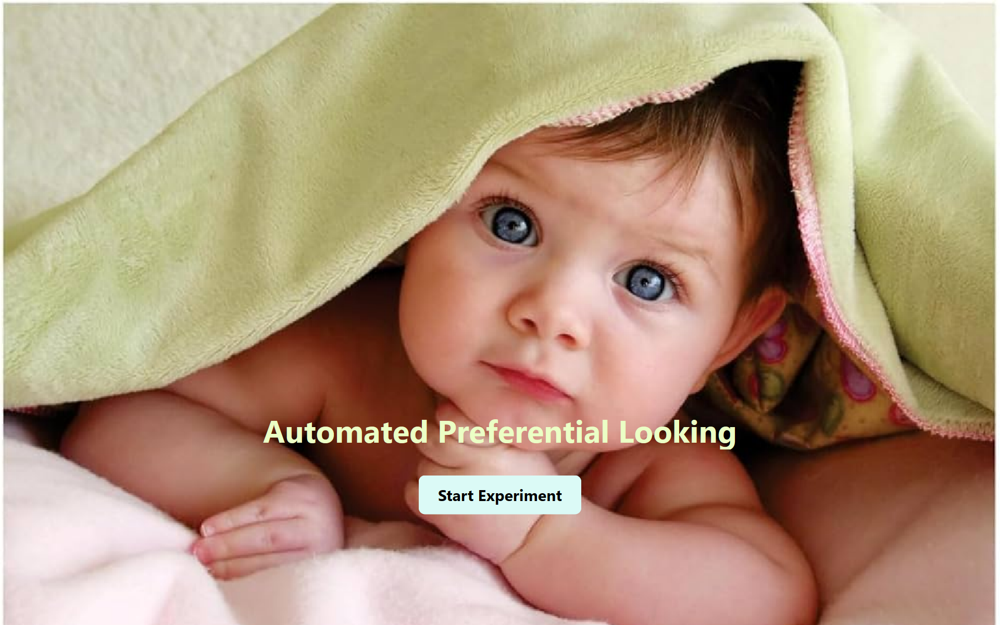
 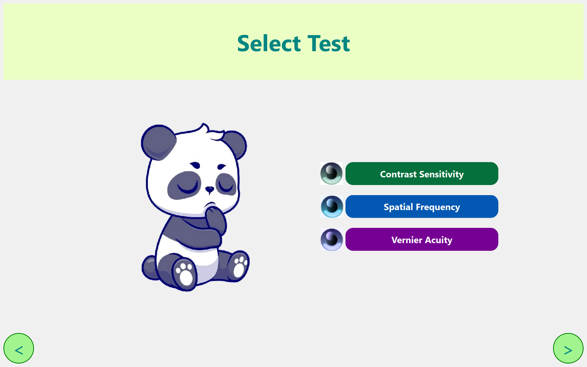
 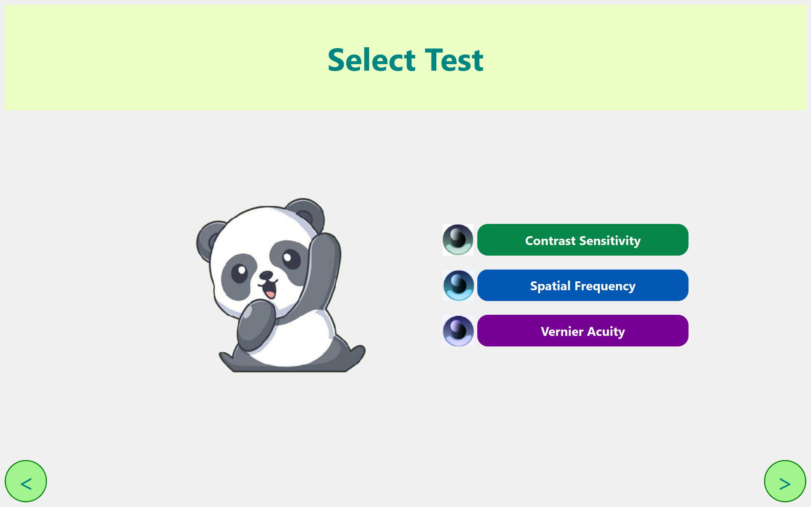
 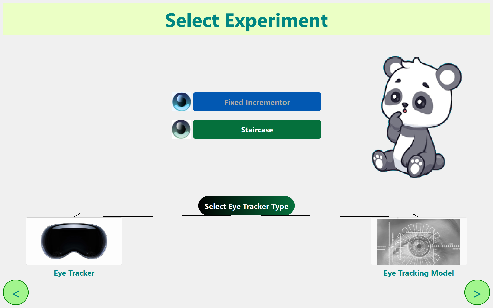
 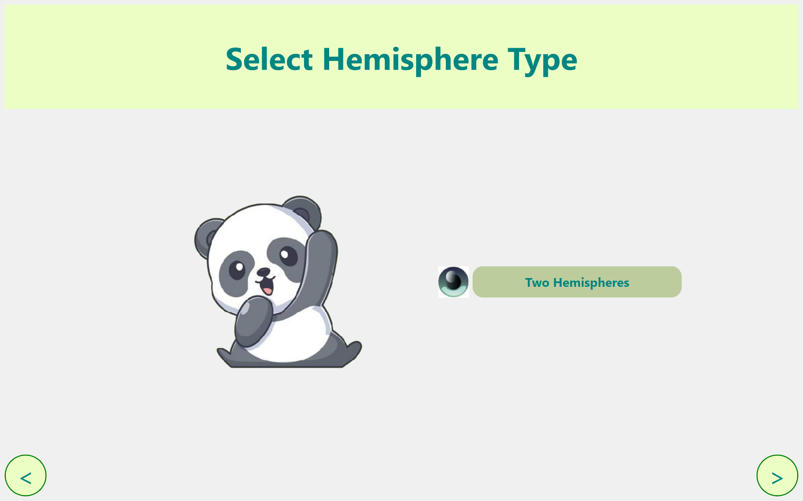
 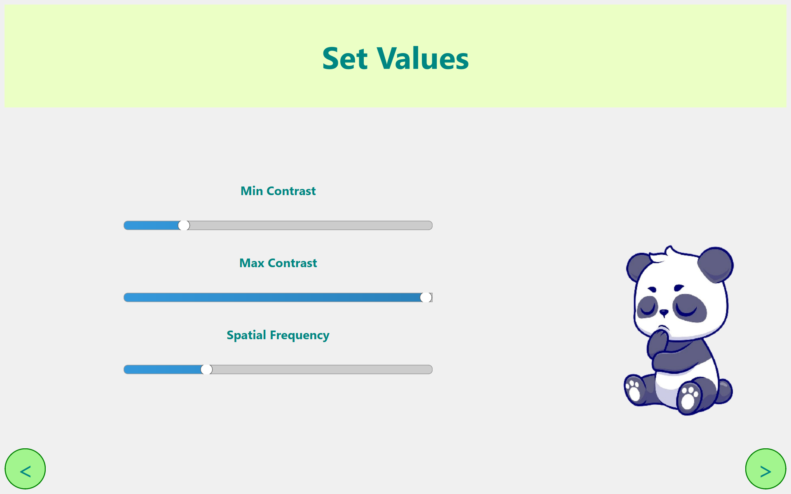
 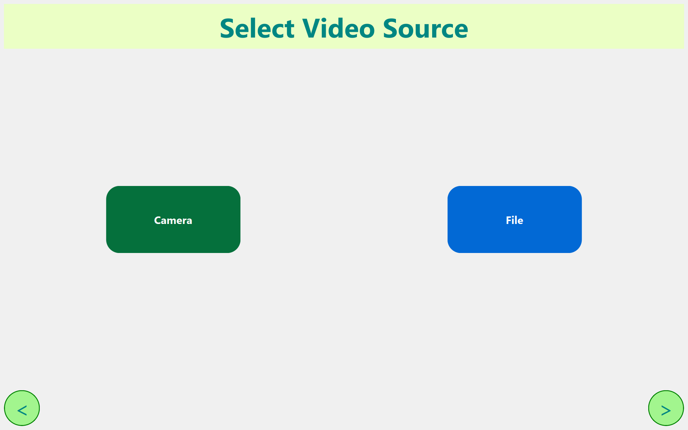
 <!--  -->
 2. Once you've chosen the particular experiment and configured the parameter values, the experiment commences. Here is the example of staircase pattern of spatial frequency experiment using eye tracking model
 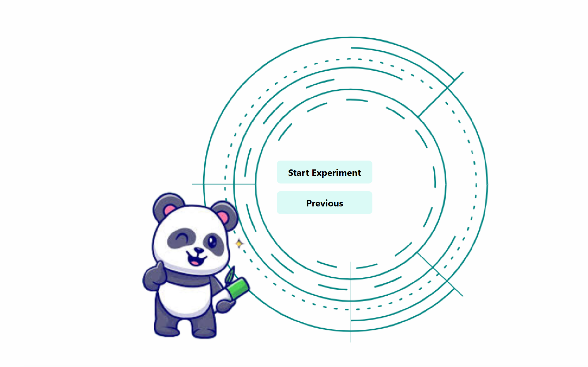
 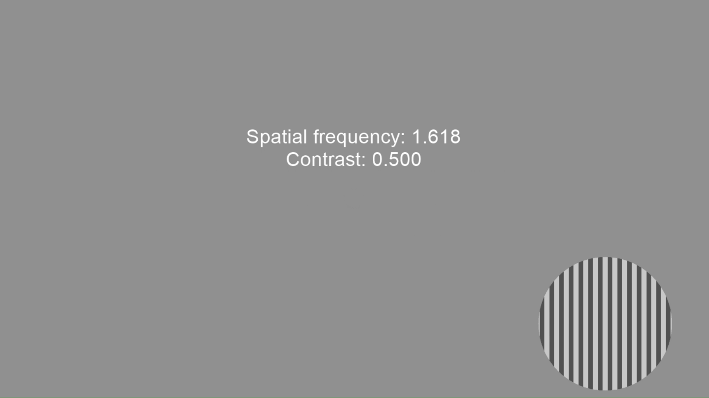
 3. Upon finishing the experiment, you'll see the psychometric function.
 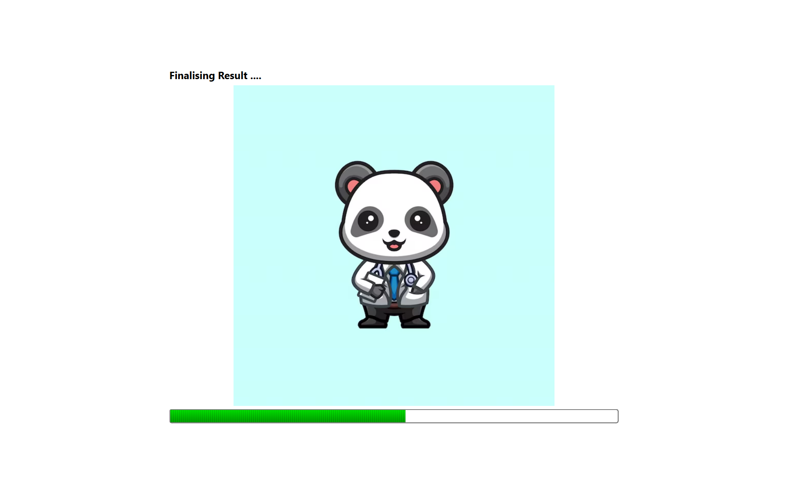
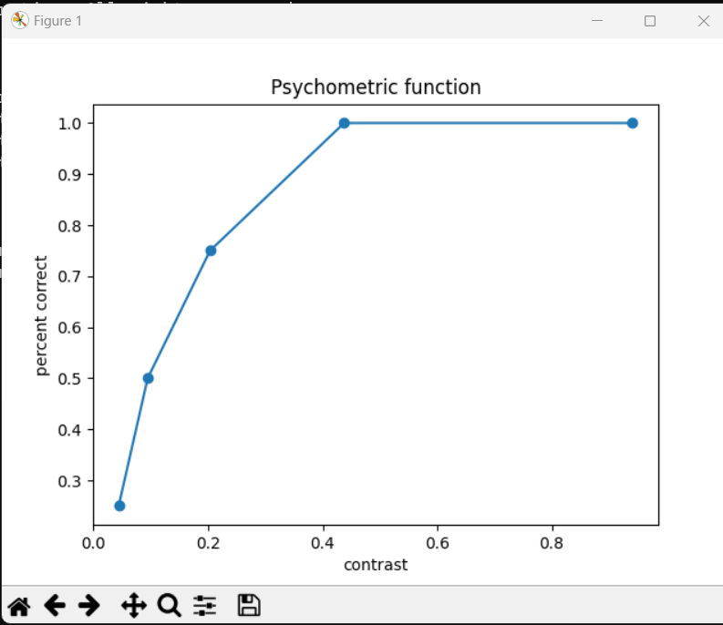
-----------------------------------------------------
<!-- FUTURE -->
<!-- <h2 id="future"> Future Goals </h2> -->
## Future Goals

Alas, the end of Summer of Code shouldn't be the end of this project! With an amazing scope to go forward, I would love to put much more effort extend this application to be used in a clinical setting with help and testing from other researchers and labs we already had contact with.The project has laid a strong foundation for such an application for efficient measurement of visual functions in infants and young children. Future work may include:

 * Adding 4 quadrant support when using the eye traking model. Two approaches for the same have already been discussed above and future work would be to actually have a working solution using them to replace/extend our current eye tracking model.

* Further refinement and optimization of the deep learning-based infant eye tracker model to improve accuracy.

* Collaborations with healthcare professionals and researchers to refine and validate the application's use in clinical settings.

Also due to the unavailibility of traditional eye tracking devices, eye tracker integration was not possible so instead for those experiments currently input is being taken through keyboard. But later it can also be implemented easily using the API developed by [Ioannis Valasakis](https://github.com/wizofe/ao-baby-tracker)

-----------------------------------------------------

<!-- Acknowledgments -->
<!-- <h2 id="acknowledgments"> Acknowledgments! </h2> -->
## Acknowledgments
I'd like to express my heartfelt gratitude to my mentor, Dr. Suresh Krishna from McGill University, for his unwavering support and guidance throughout this project. His deep expertise and thoughtful insights have been invaluable in shaping the direction and success of this work. The complexities we navigated together have laid a strong foundation for future advancements in this field, and I am immensely grateful for his mentorship.

I would like to extend my sincere thanks to my mentor, Soham Mulye, whose guidance and support were instrumental in the success of this project. His ability to distill complex information into actionable advice greatly facilitated my understanding and application of key concepts. The knowledge and skills I gained under his mentorship will undoubtedly enhance future developments and collaborations in this domain.

I would also like to extend my appreciation to the developers of [iCatcher+](https://github.com/icatcherplus/icatcher_plus), the eye-tracking model that has been seamlessly integrated into the program for gaze detection and test automation.

I would also like to extend my appreciation to the developers of [Look-it daaset](https://osf.io/5u9df/). This is a dataset of video and annotation files contributed to the automated eye gaze coding project iCatcher+and was also used here to test the software on actual infants.

With the generous support of Google's open-source initiatives, I hope that I've sown the seeds of a useful program and provided valuable code suggestions. These contributions have the potential to make a significant impact in clinical settings in the future. Thank you, Google!
